# Getting up and running with the Example Project

Using Firebase with Fuse can be a little daunting to set up at first as there appears to be a lot of moving parts. However it's not to bad once you have run through the process once so what we will do is take the included example and go through setting it up with your own firebase account.

## The Goal

We are going to set up the example app which will Authenticate on both iOS and Android using Google, Facebook and Email login providers

## And so it starts..

You can find the example in the `AuthExample` folder. It contains:

- AuthExample.unoproj - Our project file
- MainView.js - The JS for the app
- MainView.ux - The Super basic UI for our app
- AndroidImpl.uxl - A little bootstrapping to get some files into the correct place in the build

At this point it will not build, as we are missing a bunch of config files from firebase. We will have those soon :)

## Some basic concepts for our library

Firebase's client API allows only one user to be logged in at a time, so rather than have some kind of handle to the user that could expire we have a single static user that may or may not be authenticated.

Firebase's authentication api has a number of 'providers', we current support 3 of them: Google, Facebook & Email

Google and Facebook authentication involves using the facebook/google apis to authenticate the user, this then returns a token that is then used to authenticate against firebase. If you quit your app the token is maintain so that you will be automatically logged in when you next load the app.

Email authentication is provided by Firebase themselves and as such there is no 2 stage login or token. There is also no automatic reauthentication when returning to the app.

If you want an overview of the JS API see [this wiki page](https://github.com/cbaggers/Fuse.Firebase/wiki/Javascript-API)

## Kicking off the Firebase bit

- Make yourself a Firebase account

- Go to [the Firebase console](https://console.firebase.google.com/)
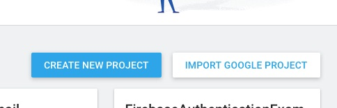

- Create yourself a new project, name it `AuthExample`

## Add Android App

- Click 'Add Firebase to your Android app' button

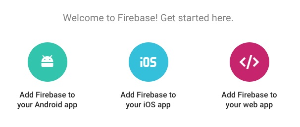

- Set the package name to `com.apps.authexample`
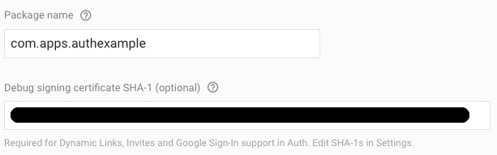

- Set the 'Debug signing certificate SHA-1' to the debug sha1 you get from running:
  - in osx: `keytool -exportcert -list -v -alias androiddebugkey -keystore ~/.android/debug.keystore`
  - in windows: `keytool -exportcert -list -v -alias androiddebugkey -keystore %USERPROFILE%\.android\debug.keystore`
- Save the config file & copy to your project directory next to the `unoproj`

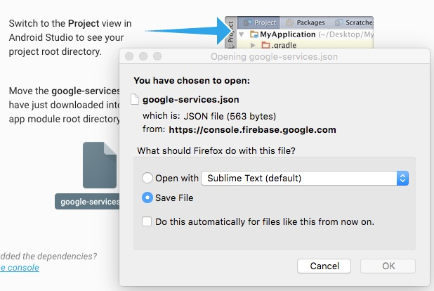
- don't worry about the 'Add to build.gradle' step, we do that for you

## Add iOS App

- Click the `Add App` button and then the `Add Firebase to your iOS app` button
- Set the 'iOS bundle ID' to `com.apps.authexample`

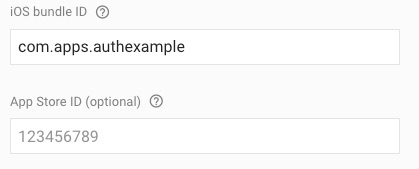
- unless you already have one then ignore the `App Store ID` section
- save the config file & copy to your project directory next to the `unoproj`

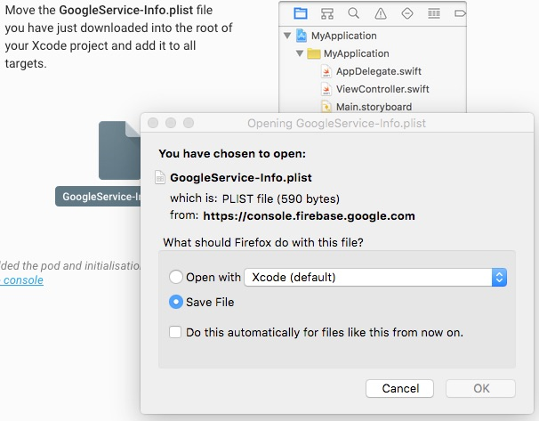
- add `"GoogleService-Info.plist:ObjCSource:iOS"` to the `"Includes"` of your `unoproj` file
- Dont worry about the `Install pod` and `Add initialization code` sections, we handle this for you

## Useful Authentication Defaults

We are going to allow multiple accounts with the same email address for now. We do this to make testing easy for ourselves as we probably dont have 100 different emails hanging around for this kind of testing.

- Go to the `Auth` section of the Firebase Console
- Go to the `Sign-in method` tab
- Click the `CHANGE` button in the `One account per email address` section
- In the window that opened, click the radio button to `Allow creation of multiple accounts with the same email address`

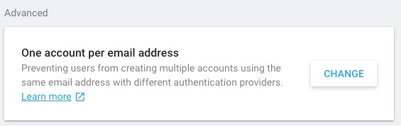

## Email Authentication Setup

- Go to the `Auth` section of the Firebase Console
- Go to the `Sign-in method` tab
- Click on the `Email/Password` row in the `Sign-in providers` table
- In the window that opened move the `Enable` switch to the on position
- Save

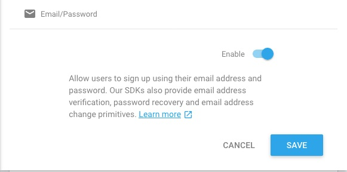

## Google Authentication Setup

- Go to the `Auth` section of the Firebase Console
- Go to the `Sign-in method` tab
- Click on the `Google` row in the `Sign-in providers` table
- In the window that opened move the `Enable` switch to the on position
- Save

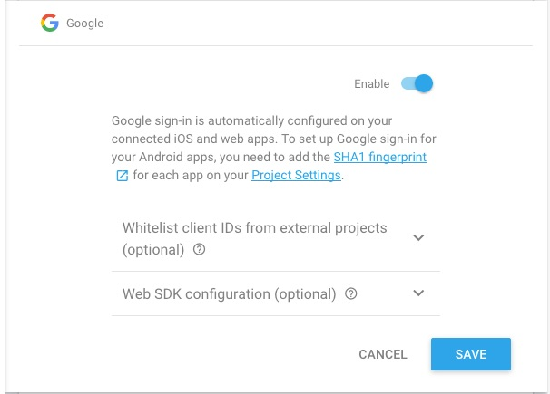

- Open your GoogleService-Info.plist file and copy the string paired to `REVERSED_CLIENT_ID`
- Paste this as your `iOS->PList->UriSchemes` value in your `unoproj` file
- Open your `google-services.json` file
- Copy your `client->client_id` value (the one with `client_type: 3`
- Paste this as your `Google->RequestID` value in your `unoproj` file

## Facebook Authentication Setup
- Go to [https://developers.facebook.com/](https://developers.facebook.com/) and create a new app (you will of course need an account)

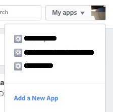
- Click iOS
- Give your app a name (for sanity reasons we will use the lowercase version of your app name) `authexample`
- On the next page ignore `is this a test version of another app` and fill in your contact email and category
- Click `Create App ID`

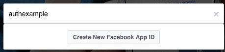
- You will now be taken to the quick start documentation, click the `Skip Quickstart` button 
- You should now be in the dashboard
- Copy the `App ID` and `App Secret` as we will need those soon

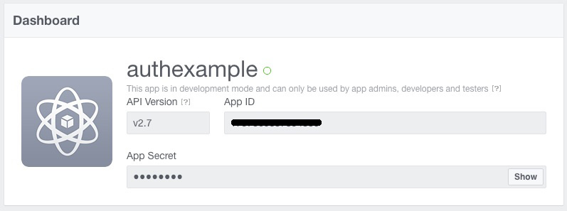
- Add the `App ID` to your `unoproj` under the `Facebook->AppID` key
- Back in the facebook dashboard navigate to Settings->Basic and click on the `Add Platform` button.

- Choose `Android`
- Enter `com.apps.authexample` name as both the `Class Name` and the `Google Play Package Name`. It is not a valid `Google Play Package Name` but it serves well as a placeholder during development
- Enter your `Key Hashes`. If you dont have release hashes yet use `keytool -exportcert -alias androiddebugkey -keystore ~/.android/debug.keystore | openssl sha1 -binary | openssl base64` to get your debug key hash. **WARNING** test your password on the `keytool -exportcert -alias androiddebugkey -keystore ~/.android/debug.keystore` portion first as if you enter the wrong password you will get the hash of the 'you entered and incorrect password' message :)
- You can also turn on `Single Sign On` if you like (We do in the example).

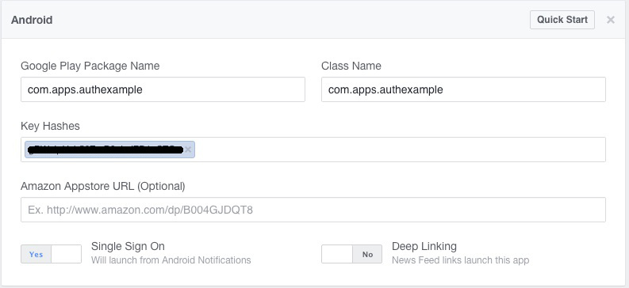
- When you save your will be warned that `There was a problem verifying the package name com.apps.authexample on Google Play` you can safely ignore this error and click the `use this name` button if you are currently in the developement stage.

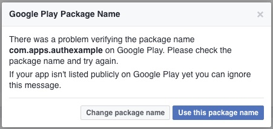
- Back in the Firebase Console return to the `Sign-in Method` tab in the `Auth` section
- Click on the `Facebook` row in the `Sign-in providers` table
- In the window that opened move the `Enable` switch to the on position
- Paste your facebook `App ID` and `App Secret` into the boxes.
- Copy the `OAuth redirect URI`
- Click the `Save` button

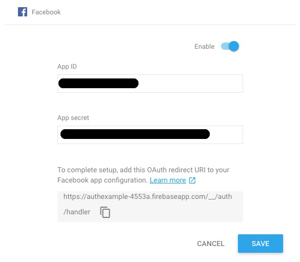
- Back in your Facebook Console click the `Add Product` button in the sidebar
- Click `Get Started` on the `Facebook Login` row

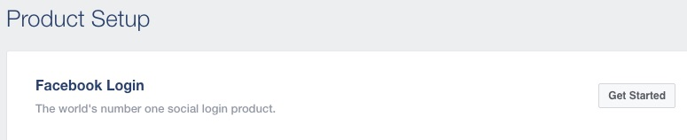
- Paste your Firebase `OAuth redirect URI` in the `Valid OAuth redirect URIs` box
- Click the `Embedded Browser OAuth Login` switch so it says `Yes`
- Click the `Save Changes` button

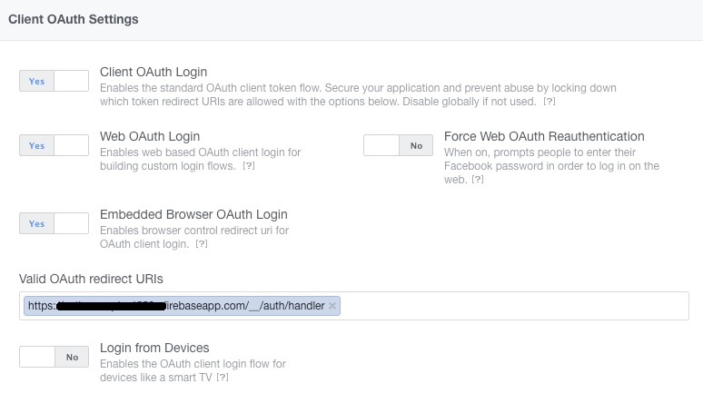

## Running the Sample

### Build for Android

Use: `fuse build -t=android -r`

### Build for iOS

Use: `fuse build -t=iOS -DCOCOAPODS -d`

`Warning!`: The first build may take a crazy long time because of cocoapods.
Trying building with `fuse build -t=iOS -DCOCOAPODS -vv` and you will probably see it is sitting at `Setting up CocoaPods master rep`. If so see this link for details http://stackoverflow.com/questions/21022638/pod-install-is-staying-on-setting-up-cocoapods-master-repo
